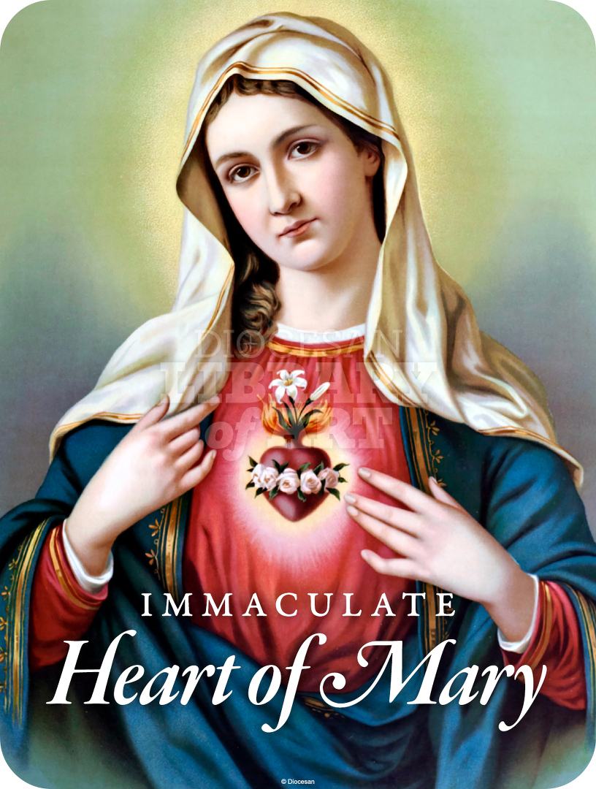

## Litany of the Immaculate Heart of Mary

Lord, have mercy on us.  
Christ, have mercy on us.  
Lord, have mercy on us. Christ, hear us.  
Christ, graciously hear us.  
God the Father of Heaven,  
Have mercy on us.  
God the Son, Redeemer of the world,  
Have mercy on us.  
God the Holy Spirit,  
Have mercy on us.  
Holy Trinity, one God,  
Have mercy on us.

Heart of Mary, pray for us.  
Heart of Mary, according to the heart of God, pray for us.  
Heart of Mary, united to the Heart of Jesus, pray for us.  
Heart of Mary, organ of the Holy Spirit, pray for us.  
Heart of Mary, sanctuary of the Divine Trinity, pray for us.  
Heart of Mary, tabernacle of God Incarnate, pray for us.  
Heart of Mary, immaculate in your conception, pray for us.  
Heart of Mary, full of grace, pray for us.  
Heart of Mary, blessed among all hearts, pray for us.  
Heart of Mary, throne of glory, pray for us.  
Heart of Mary, most humble, pray for us.  
Heart of Mary, holocaust of Divine Love, pray for us.  
Heart of Mary, fastened to the Cross with Jesus Crucified, pray for us.  
Heart of Mary, comfort of the afflicted, pray for us.  
Heart of Mary, refuge of sinners, pray for us.  
Heart of Mary, hope of the agonizing, pray for us.  
Heart of Mary, seat of wisdom, pray for us.

Christ, hear us.  
Christ, graciously hear us.

Immaculate Heart of Mary, meek and humble of Heart,  
Make our hearts according to the Heart of Jesus.

Let us pray:

O most merciful God, who for the salvation of sinners and the refuge of the wretched, has made the Immaculate Heart of Mary most like in tenderness and pity to the Heart of Jesus, grant that we, who now commemorate her most sweet and loving heart, may by her merits and intercession, ever live in the fellowship of the hearts of both Mother and Son, through the same Christ our Lord. Amen.
