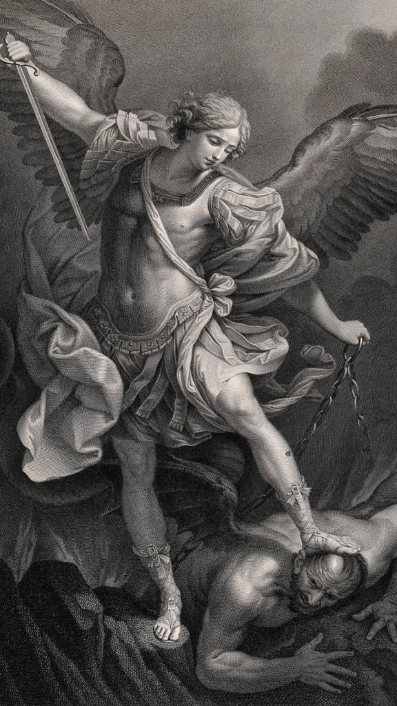
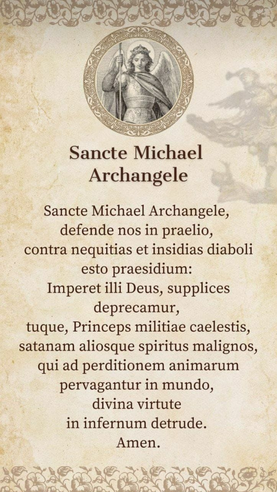

  
  

On 29 September the Church celebrates the Feast of the Archangel Michael, known in Ireland and Britain as **Michaelmas**.

Saint Michael, whose name means *"Who is like God?"*, is named in Scripture as a prince of the heavenly host and the great protector of God's people:

- "At that time shall arise Michael, the great prince who has charge of your people." (Daniel 12:1)
- "But when the archangel Michael, contending with the devil, disputed about the body of Moses, he did not presume to pronounce a reviling judgment upon him, but said, 'The Lord rebuke you.'" (Jude 1:9)
- "Now war arose in heaven, Michael and his angels fighting against the dragon." (Revelation 12:7)

The Church honours him as the defender of the faithful against the snares of the devil, the one who comes to the aid of souls at the hour of death, and the patron of the universal Church.

## Prayer to Saint Michael the Archangel

Pope Leo XIII composed this prayer in 1886 and ordered it prayed after Low Mass.

Saint Michael the Archangel,  
defend us in battle.  
Be our protection against the wickedness and snares of the devil.  
May God rebuke him, we humbly pray;  
and do thou, O Prince of the heavenly host,  
by the power of God,  
thrust into hell Satan and all the evil spirits  
who prowl about the world  
seeking the ruin of souls. Amen.
